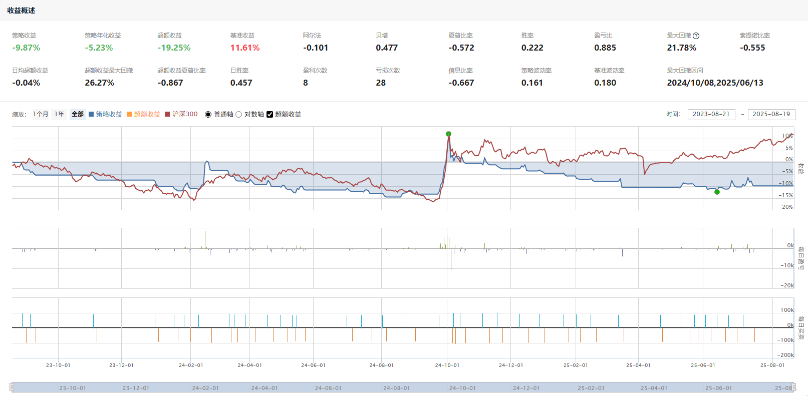

# Simple MA5 Strategy (Quant Trading Demo)

**Author:** Wwjd1232  
**Template Reference:** adapted from chgenedu/oa-trading-algo  

---

## 1. Strategy Idea
This is a simple **MA5 crossover strategy** applied on a single stock (`000001.XSHE`, Ping An Bank).  

- **Buy Rule:** If the latest closing price > 1.01 × 5-day moving average and there is available cash → buy with all cash.  
- **Sell Rule:** If the latest closing price < 5-day moving average and the portfolio holds stock → sell all shares.  
- **Frequency:** The strategy runs daily (scheduled before open, at open, and after close).  
- **Benchmark:** CSI 300 index (`000300.XSHG`).  

This strategy demonstrates **momentum-based entry and exit** using a short-term moving average.

---

## 2. Backtest Results

| Metric | Value |
|--------|-------|
| Strategy Return | -9.87% |
| Benchmark Return | 11.61% |
| Annualized Return | -5.23% |
| Max Drawdown | 21.78% |
| Sharpe Ratio | -0.555 |
| Win Rate | 22.2% |

📈 **Equity Curve**  

---

## 3. How to Run
### 3.1 QuantConnect / Lean
- Create a new **Python project**.  
- Copy `src/main.py` into `main.py`.  
- Backtest with your chosen start & end date.  

### 3.2 JoinQuant (聚宽)
- Copy the code from `src/main.py` into JoinQuant’s research platform.  
- Run backtest with CSI 300 as benchmark.  

---

## 4. Parameters
- **MA window:** 5 days  
- **Buy threshold:** 1% above MA5  
- **Commission:** 0.03%, minimum 5 CNY per trade  
- **Stamp Duty:** 0.1% on sell trades  

---

## 5. Files
main.py          # Strategy code
figures.png # Backtest performance chart
LICENSE              # MIT
---

## 6. Disclaimer
This repository is for **educational purposes only**.  
Not investment advice.
